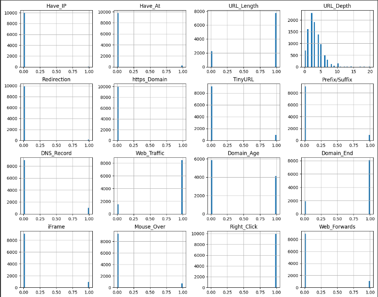
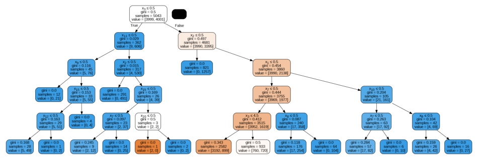
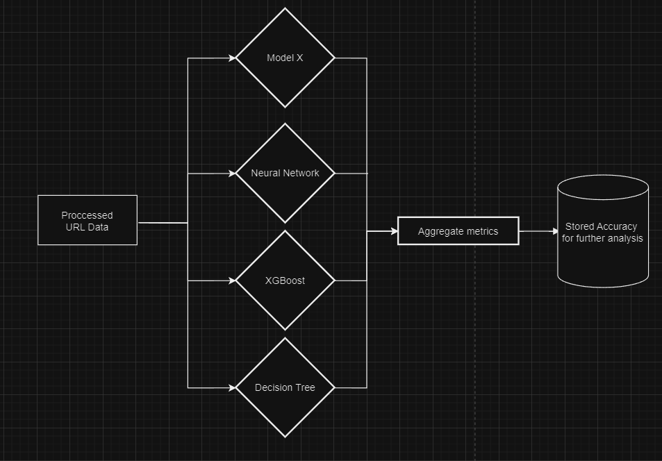
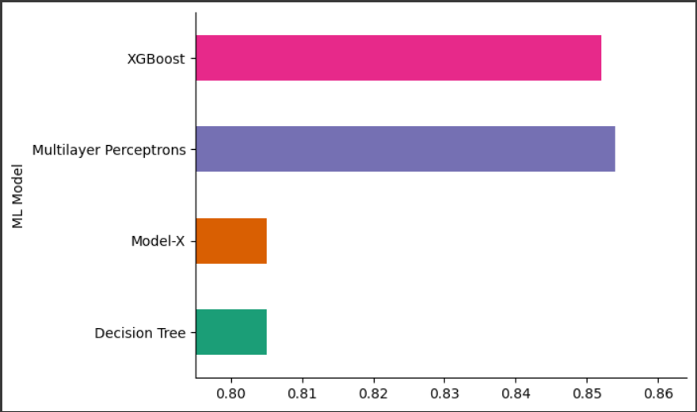

# REV-ENG-PHISHING-SYS

  

### 1.Reverse Engineering a Black-Box Model: Identifying a Random Forest Model
The process of reverse engineering a black-box model to determine its underlying structure involves a systematic approach to understanding the model's behavior, architecture, and decision-making processes. In this analysis, we start with the assumption that the model is entirely opaque, and we aim to infer that it is a Random Forest model through careful examination of its outputs, structure, and operational characteristics.

#### 1. Model Loading and Initial Inspection
The first step in our analysis was to load the black-box model, which was saved in a serialized format (model.pickle.dat). Using Python's pickle module, we deserialized the model to examine its structure. The absence of explicit metadata necessitated a direct inspection of the deserialized object. By investigating the object type and attributes, we noted the presence of an ensemble of decision tree estimators, a hallmark of Random Forest models.

#### 2. Structural Analysis
Upon identifying the presence of multiple decision trees within the model, we conducted a deeper structural analysis. We iterated through the individual trees to assess their depth, split criteria, and leaf nodes. The consistent structure across multiple trees, combined with identical hyperparameters such as maximum depth and minimum samples per leaf, strongly suggested that the model was an ensemble-based method. The large number of estimators, typically found in Random Forests, was another clue pointing to this specific model type.

#### 3. Feature Importance Analysis

One of the distinguishing features of a Random Forest model is its ability to provide feature importances, which quantify the contribution of each feature to the model's decision-making process. By extracting and analyzing the feature_importances_ attribute, we observed a non-trivial distribution of importance scores across the input features. This distribution is consistent with how Random Forest models operate, as they aggregate the importance scores derived from individual trees. The presence of this attribute further reinforced our hypothesis that the model in question was indeed a Random Forest.

#### 4. Tree Visualization

To gain a more granular understanding of how the model makes decisions, we visualized individual decision trees within the ensemble. We began by loading the Random Forest model from the model.pickle.dat file and extracted one of the decision trees. Using the export_graphviz function from the sklearn.tree module, we converted the tree into a Dot format. This was then processed with pydotplus to generate a PNG image, which we displayed using matplotlib. This visualization allowed us to inspect the decision paths, node splits, and class predictions in detail. The diversity among the trees, while maintaining a consistent overall structure, aligned with the expected behavior of Random Forests, where each tree is trained on a different bootstrap sample and considers a random subset of features at each split.

#### 5. Model Evaluation and Decision Path Analysis
To further validate our identification of the model, we evaluated its performance on a test dataset. The high accuracy and robustness across various subsets of data indicated that the model was leveraging an ensemble approach, which is characteristic of Random Forests. Additionally, by analyzing the decision paths for specific instances, we observed that the final predictions were determined by aggregating the outputs of multiple trees, a definitive trait of Random Forest models.

### 2.Benchmarking Classification Models for Phishing Detection
In the second phase of our analysis, we aimed to benchmark various classification models to identify the most effective approach for detecting phishing URLs. The process involved comparing the performance of different models, including our pre-trained model, Model X (Random Forest), Decision Trees, XGBoost, and Neural Networks, using a well-structured and feature-rich dataset.

#### 1. Data Preprocessing and Feature Selection
We started with a dataset containing URL information stored in url.csv. The dataset included 17 features such as URL depth, length, and various attributes related to the structure and composition of the URLs.
URL Depth and Length Analysis: We focused on analyzing the depth and length of the URLs, as these are critical indicators in phishing detection. The depth was calculated based on the number of subdirectories within the URL, and the length was measured as the total character count.
Dropping Non-Numerical Features: During the preprocessing phase, we identified that the domain name feature was non-numerical and therefore not directly usable in most machine learning algorithms. As a result, we decided to drop the domain feature from our analysis to ensure that only numerical features were fed into the models.
Processed Data: The cleaned and processed data from url.csv, now consisting of 17 carefully selected features, was then used to train and benchmark the classification models.

#### 2. Model Training and Evaluation
We trained three popular classification models—Decision Trees, XGBoost, and Neural Networks—on the same processed dataset, alongside our pre-trained Model X (Random Forest). Each model was assessed based on accuracy, precision, and recall to ensure a consistent and comparative analysis.

### 1. Decision Tree

A Decision Tree recursively splits the dataset into subsets based on feature values to minimize a loss function.

- **Gini Impurity:**

  

  where \( p_i \) is the probability of class \( i \) at a given node.

- **Information Gain:**

  %20-%20%5Csum_%7Bi%3D1%7D%5Fk%20%5Cfrac%7B%7CS_i%7C%7D%7B%7CS%7C%7D%20H(S_i))

  where \( H(S) \) is the entropy of the original dataset \( S \), and \( H(S_i) \) is the entropy of each subset created by a split.

### 2. Random Forest

A Random Forest is an ensemble of Decision Trees, where each tree is trained on a bootstrap sample of the dataset, using a random subset of features to determine the best splits.

- **Prediction of Random Forest:**

  )

  where \( T_i(x) \) is the prediction of the \( i \)-th tree for input \( x \), and \( N \) is the total number of trees in the forest.

### 3. XGBoost (Extreme Gradient Boosting)

XGBoost builds trees sequentially, where each tree tries to correct the errors of the previous ones by minimizing a regularized loss function.

- **Objective Function:**

  %20%3D%20%5Csum_%7Bi%3D1%7D%5En%20l(%5Chat%7By%7D_i%2C%20y_i)%20%2B%20%5Csum_%7Bk%3D1%7D%5EK%20%5COmega(f_k))

  where \( l(\hat{y}_i, y_i) \) is the loss function, and \( \Omega(f_k) \) is the regularization term.

- **Regularization Term:**

  %20%3D%20%5Cgamma%20T%20%2B%20%5Cfrac%7B1%7D%7B2%7D%20%5Clambda%20%5Csum_%7Bj%3D1%7D%5ET%20w_j%5E2)

  where \( T \) is the number of leaves, \( w_j \) are the leaf weights, \( \gamma \) controls the number of leaves, and \( \lambda \) controls \( L2 \) regularization.

- **Prediction:**

  %7D%20%3D%20%5Chat%7By%7D_i%5E%7B(t-1)%7D%20%2B%20f_t(x_i))

  where \( \hat{y}_i^{(t)} \) is the prediction at iteration \( t \), and \( f_t(x_i) \) is the prediction of the \( t \)-th tree.

### 4. Multilayer Perceptron (Neural Network)

A Multilayer Perceptron (MLP) is a type of neural network with multiple layers of neurons, including an input layer, one or more hidden layers, and an output layer.

- **Activation Function:**

  %7D%20%3D%20f(W%5E%7B(l)%7D%20%5Ccdot%20a%5E%7B(l-1)%7D%20%2B%20b%5E%7B(l)%7D)

  where \( a^{(l)} \) is the activation of layer \( l \), \( W^{(l)} \) is the weight matrix, \( b^{(l)} \) is the bias vector, and \( f \) is the activation function.

- **Cost Function:**

  %20%3D%20%5Cfrac%7B1%7D%7Bm%7D%20%5Csum_%7Bi%3D1%7D%5Em%20%5CLoss(%5Chat%7By%7D%5E%7B(i)%7D%2C%20y%5E%7B(i)%7D)

  where \( J(\theta) \) is the cost function, \( m \) is the number of training examples, \( \hat{y}^{(i)} \) is the predicted output, and \( y^{(i)} \) is the actual output.

- **Backpropagation:**

  %7D%20%3D%20%5Cdelta%5E%7B(l)%7D%20%5Ccdot%20a%5E%7B(l-1)%7D)

  where \( \delta^{(l)} \) is the error term for layer \( l \), and \( a^{(l-1)} \) is the activation of the previous layer.

#### 3. Performance Comparison and Insights
XGBoost and Neural Networks significantly outperformed Model X and Decision Trees, with XGBoost excelling in accuracy and robustness due to its regularization and efficiency. Neural Networks demonstrated superior performance by effectively learning complex patterns and modeling non-linear relationships. This comparative analysis highlighted XGBoost and Neural Networks as the most suitable models for detecting phishing URLs.

#### 4. Conclusion

In conclusion, our extensive benchmarking revealed that while Model X and Decision Trees were solid baseline models, XGBoost and Neural Networks offered significantly better performance for phishing detection. The careful preprocessing of the dataset, including the analysis of URL depth and length and the exclusion of non-numerical features, played a crucial role in maximizing the effectiveness of these models. This analysis underscores the importance of selecting the right model and features when developing robust phishing detection systems.
