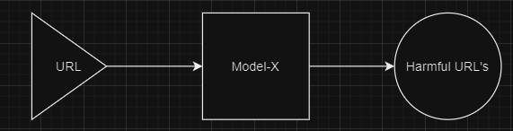
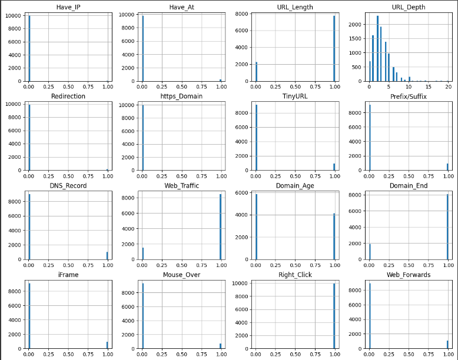
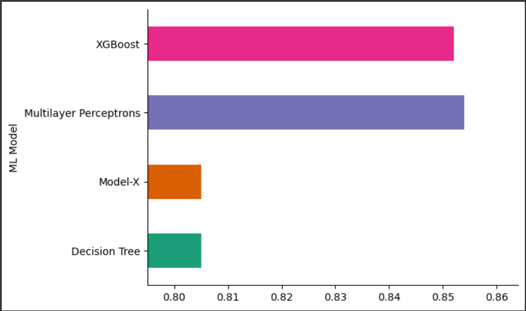

# REV-ENG-PHISHING-SYS

Reverse engineering a black-box phishing detection model to identify its architecture, then benchmarking it against Decision Trees, XGBoost, and Neural Networks on URL classification.

<p align="center">
  
</p>

## Overview

Given an opaque serialized model file, this project systematically reverse engineers it to determine the underlying architecture (Random Forest), then benchmarks four classifiers on the same URL phishing dataset. The analysis reveals that XGBoost and Neural Networks significantly outperform the original black-box model.

```mermaid
graph TB
    subgraph Phase 1: Reverse Engineering
        A[Serialized Model] --> B[Deserialize + Inspect]
        B --> C[Structural Analysis<br/>Tree Depth, Split Criteria]
        C --> D[Feature Importance<br/>Extraction]
        D --> E[Tree Visualization<br/>export_graphviz]
        E --> F[Identified: Random Forest]
    end

    subgraph Phase 2: Benchmarking
        G[urldata.csv<br/>17 Features] --> H[Preprocessing<br/>Drop Non-Numeric]
        H --> I[URL Depth + Length Analysis]
        I --> J{Model Training}
        J --> K[Decision Tree]
        J --> L[Model X: Random Forest]
        J --> M[XGBoost]
        J --> N[Neural Network]
        K & L & M & N --> O[Accuracy / Precision / Recall]
    end

    F --> L
```

## Key Findings

### Phase 1: Model Identification
- Deserialized the black-box model and identified ensemble of decision tree estimators
- Extracted `feature_importances_` attribute confirming Random Forest architecture
- Visualized individual decision trees to verify bootstrap sampling and random feature subsets



### Phase 2: Benchmark Results



- **XGBoost and Neural Networks** significantly outperformed the original Random Forest and Decision Tree baselines
- XGBoost excels due to regularization and gradient boosting efficiency
- Neural Networks captured complex non-linear patterns in URL features

## Dataset

- **Source**: `urldata.csv`
- **Features**: 17 numerical features including URL depth, length, special character counts, domain patterns
- **Task**: Binary classification (phishing vs. legitimate)
- **Preprocessing**: Dropped non-numerical `domain` column

## Quick Start

```bash
git clone https://github.com/Akasxh/REV-ENG-PHISHING-SYS.git
cd REV-ENG-PHISHING-SYS

# Reverse engineering analysis
jupyter notebook Model_Analsysis.ipynb

# Benchmark comparison
jupyter notebook Model_Benchmarking.ipynb
```

## Project Structure

```
REV-ENG-PHISHING-SYS/
├── Model_Analsysis.ipynb      # Phase 1: Reverse engineering the black-box
├── Model_Benchmarking.ipynb   # Phase 2: Multi-model benchmark
├── model.pickle.dat           # Black-box model (serialized)
├── urldata.csv                # URL dataset (17 features)
├── image/
│   ├── Blackbox.png
│   ├── feature_importance.png
│   ├── foreest_graph_visualised.png
│   ├── Analysis_on_other_models.png
│   └── Benchmark.png
└── README.md
```

## Tech Stack

- **ML**: scikit-learn (Random Forest, Decision Tree), XGBoost, PyTorch (Neural Network)
- **Visualization**: matplotlib, pydotplus, graphviz
- **Data**: pandas, NumPy
